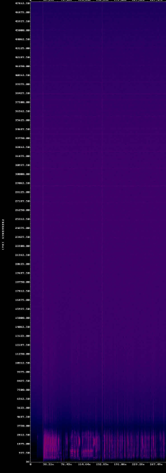

# audioqc

## About

This repository contains two scripts - audioqc and makespectrum. Both are intended to aid with collection level quality control of digitized audio files.

* audioqc: This script can target both directories and single audio files, and will generate audio quality control reports in CSV to the desktop. It can scan for peak/average audio levels, files with 'hot' portions exceeding a user set limit, audio phase, bext metadata conformance, mediaconch policy conformance, and a VERY experimental mode for detecting dropouts.

* makespectrum: This script will compile a document of audio spectrums for all inputs. It applies a high-pass filter to inputs to attempt to make visually identifying audio errors and drop-outs simpler.

## Set-up
Requires CLI installations of: ffprobe, MediaConch, MediaInfo, BWF MetaEdit, Ruby

### Mac:
* All dependencies and audioqc scripts can be installed via the [Homebrew package manager](https://brew.sh/)
* Once Homebrew is installed, run the commands `brew tap amiaopensource/amiaos` followed by `brew install audioqc` to complete the install process.

### Windows:
* [Ruby](https://rubyinstaller.org/) will need to be installed if it isn't present already.
* All dependencies will have to be added to the 'Path' and should be the command line version (CLI) of their respective tools
* MediaConch, MediaInfo and BWF MetaEdit can be downloaded from the [MediaArea](https://mediaarea.net/) website
* ffprobe can be downloaded as part of the [FFmpeg package](https://ffmpeg.org/download.html#build-windows)

### Linux:
* Most dependencies should be installable through the standard package manager.
* For the most up to date versions of MediaArea dependencies it is recommended to activate the [MediaArea](https://mediaarea.net/en/Repos) repository

## Usage:

### audioqc
`audioqc [options] TARGET`
Target can be either individual files, or a directory. This will result in a CSV output to your desktop.

A standard profile of settings and options is stored in the configuration file. If audioqc is run with no options, these stored options will be used as a default profile. To change default settings run `audioqc -o` or `audioqc --options` to edit the values contained in the associated file `audioqc.config`. 

Examples: 
* `audioqc 'My-File.wav'` (This will run with options saved in config file)
* `audioqc -m 'My-File.wav'` (This will run only a metadata scan)
* `audioqc -p 'my-mediaconch-policy.xml' -e flac 'My-Flac-Folder'` (This will target files with a .flac extension and use a custom mediaconch policy.)

__NOTE:__ If running the QC scan with output for signal information enabled, the scan can take quite a while to run on long or large numbers of files. This is expected and is because the script needs to generate information for every individual audio frame.

### makespectrums
`makespectrums TARGET`
This tool will create a compiled PDF of audio spectrums (high pass filter applied). Input can be individual files or a directory. Audio errors and drops can sometimes be identified by vertical lines that reach all the way to the top of the spectrum. (See example below which contains two dropouts)

## Maintainers
Andrew Weaver (@privatezero)

Susie Cummings (@susiecummings)
